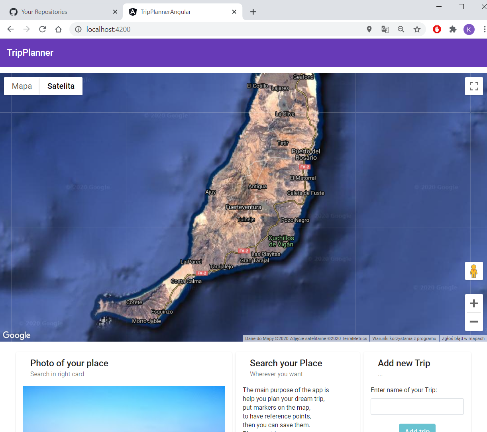
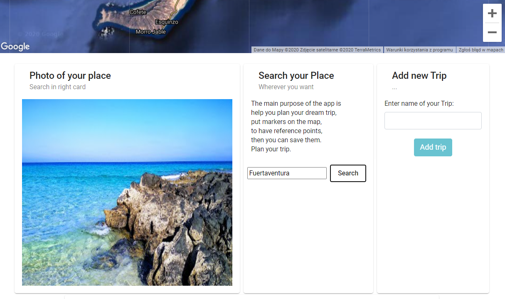
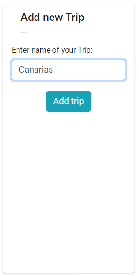
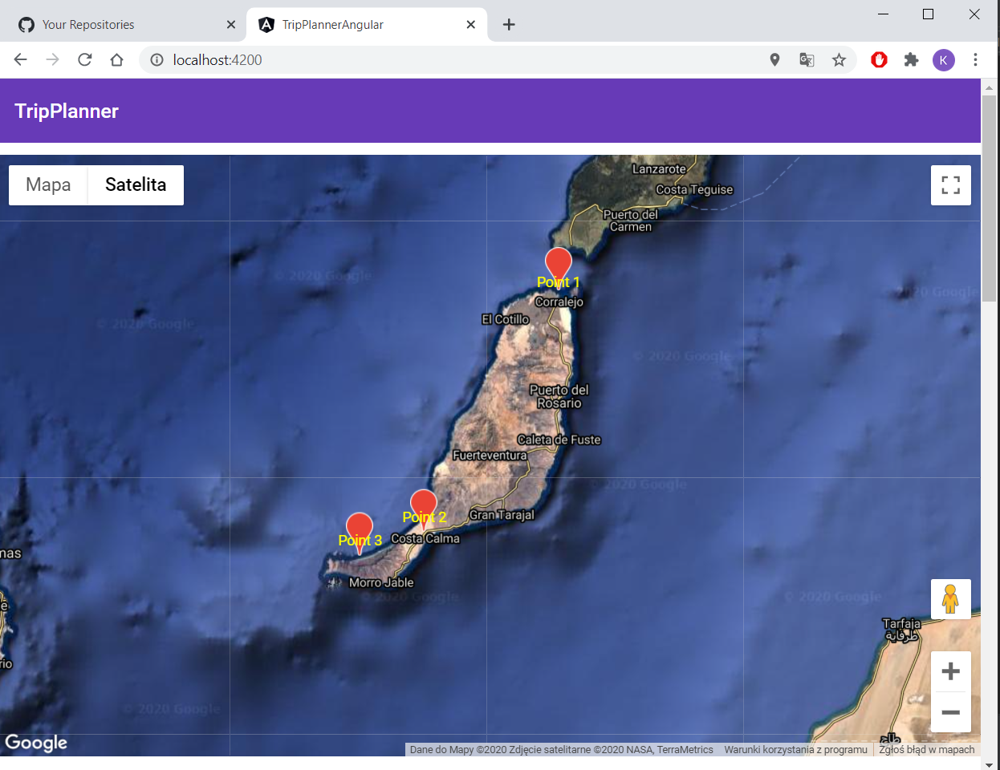
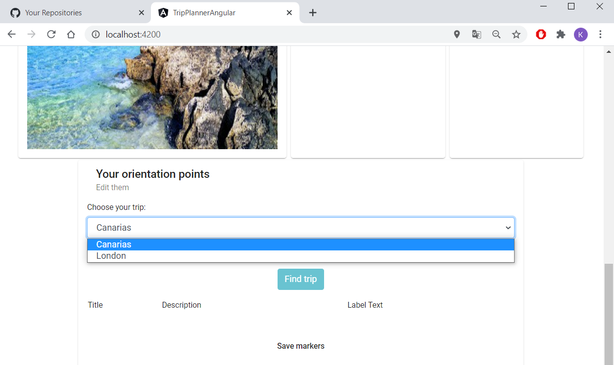
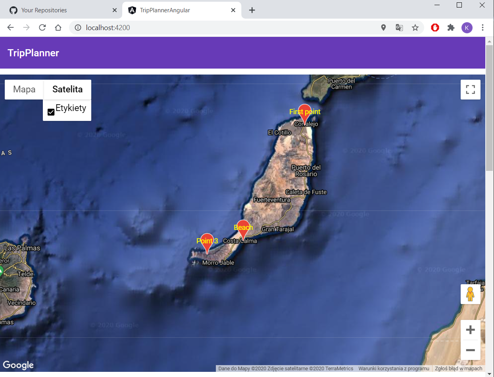
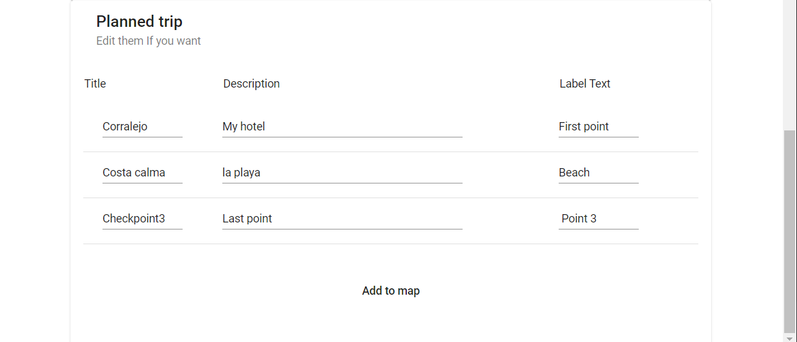

# TripPlanner
Backend - Java,
Frontend - Angular

The application allows you to search for places in the world. It uses a Google API to do this. 
Then the user can create his new trip and add markers that he wants to visit on the Map. 
The markers and trips are saved in the MySQL database in related tables. All defined tours can be displayed, edited and put on a map.

Main view:

Control panel for searching and adding Trips:

Add new Trip:

Add Markers on Map:

Choose Trip:

Edit your points:

Check map:

Load trip when you want, edit and add to Map:

